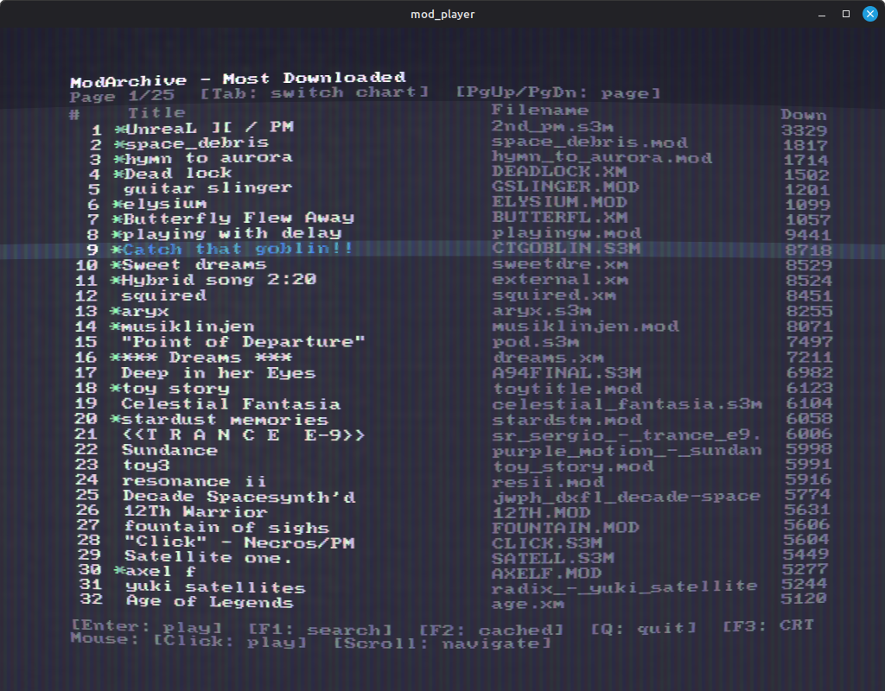
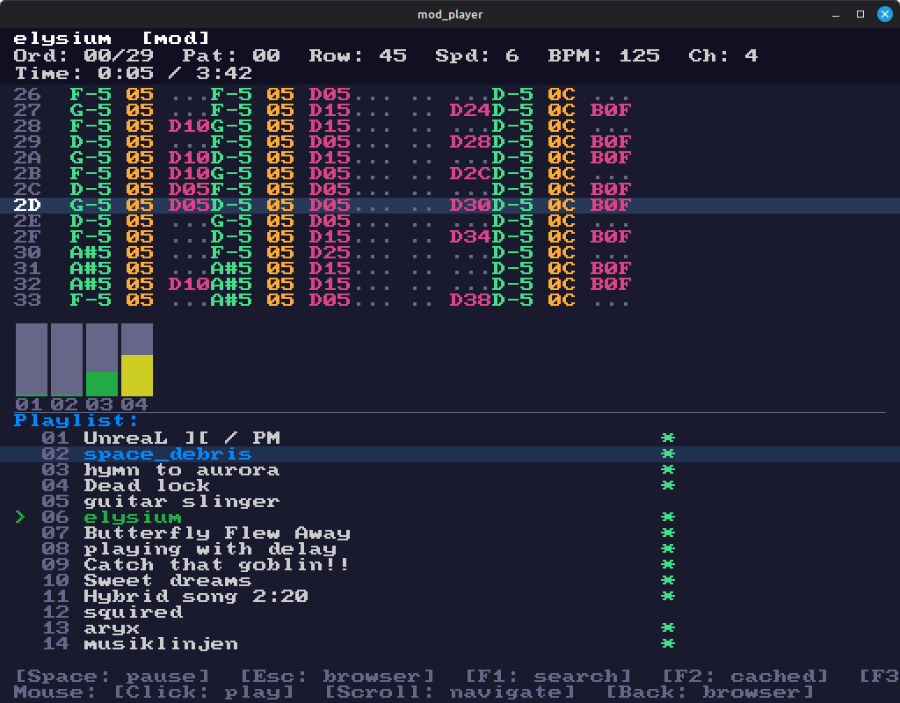
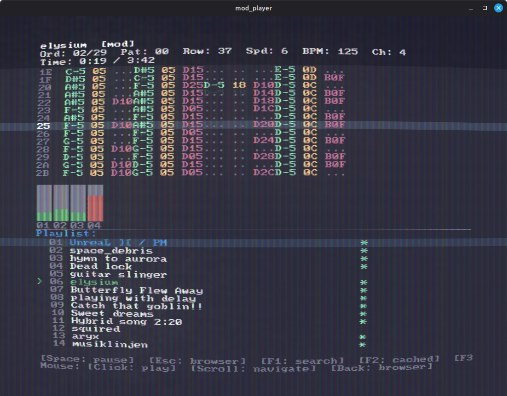
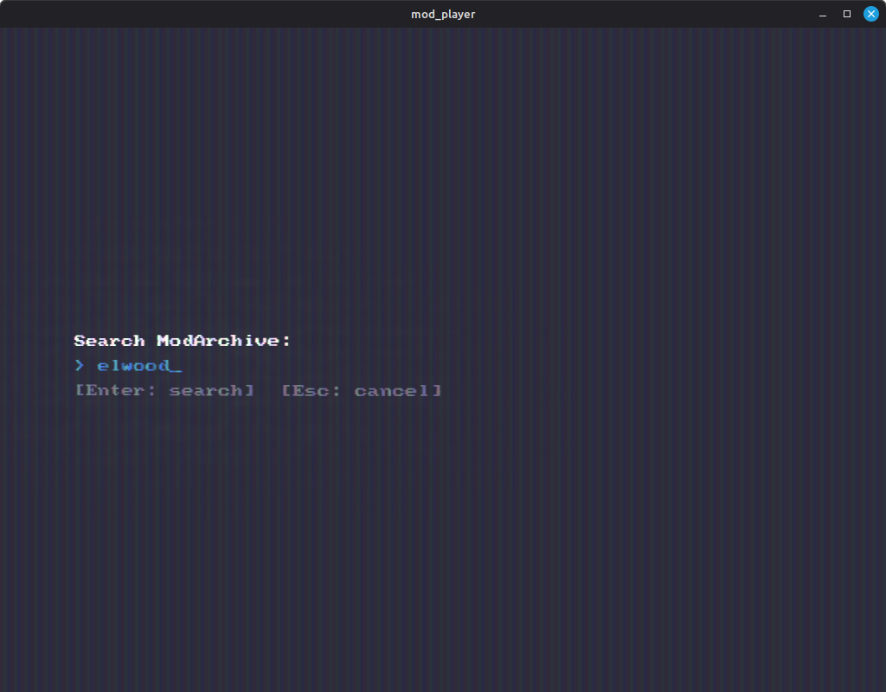
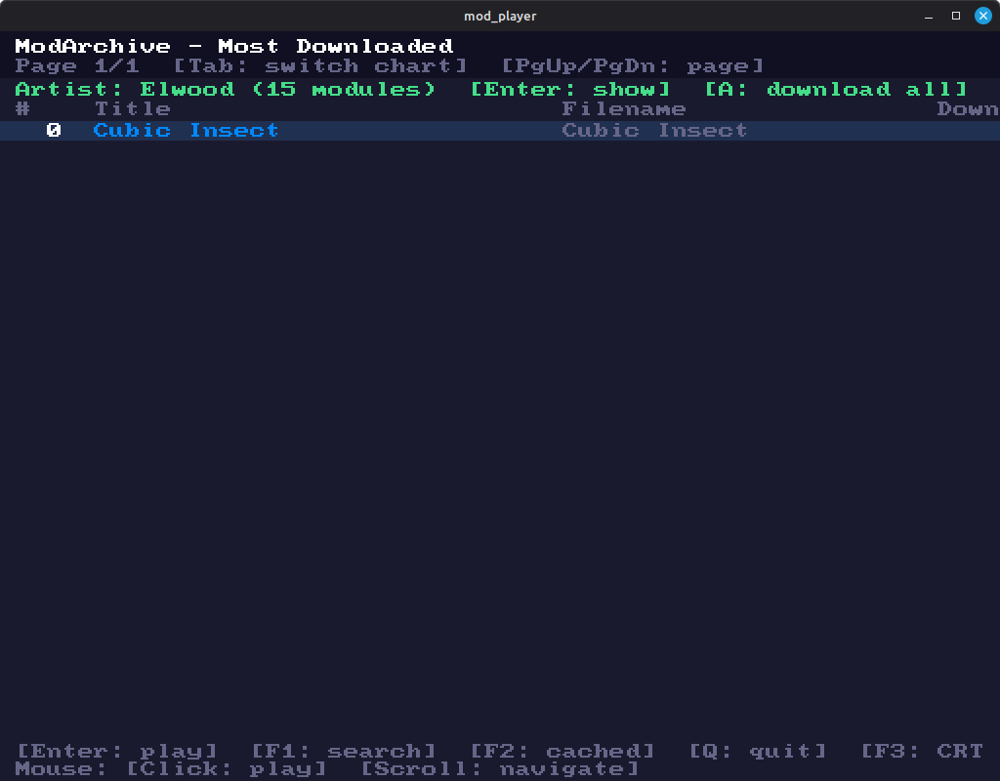
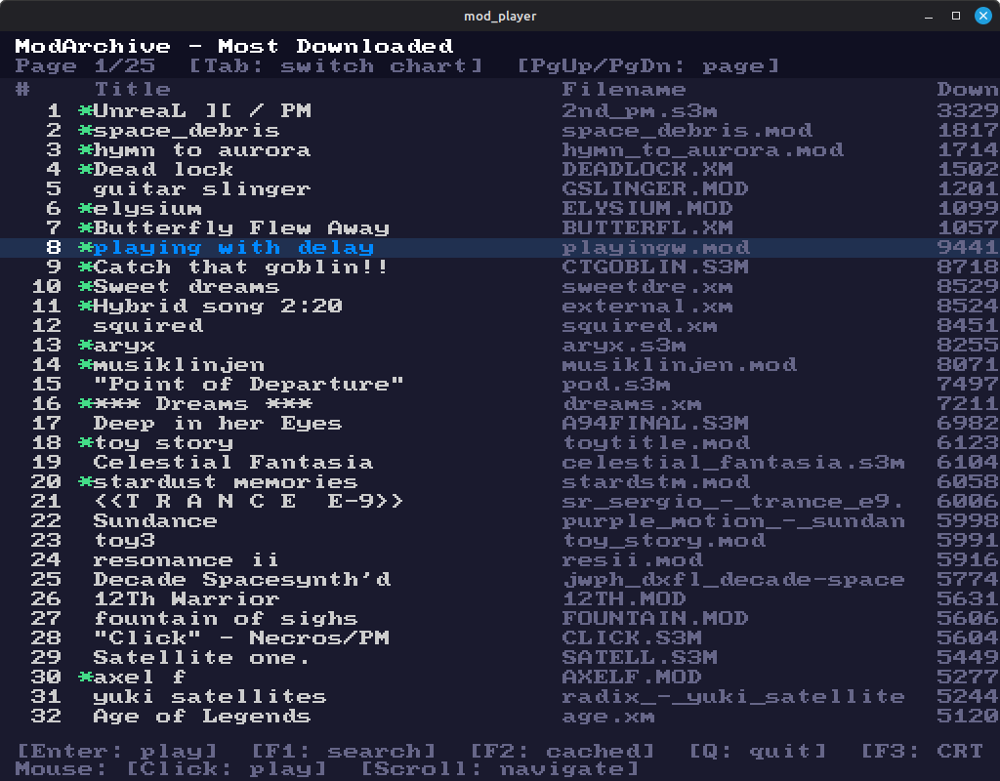

# mod_player

A tracker module player with an integrated ModArchive browser. Plays MOD, S3M, XM, IT, and MO3 files. Uses SDL2 for audio and display, libopenmpt for decoding, and libcurl for fetching modules from modarchive.org.

## Screenshots








## Features

- Browse ModArchive charts (top downloads, most revered, featured, top favourites)
- Search for modules by filename or title
- Search for artists and browse their full catalogue
- Download individual modules or batch-download an entire artist's library
- Local cache for offline playback
- Pattern view with scrolling display
- Per-channel VU meters
- CRT shader with phosphor persistence, barrel distortion, shadow mask, and bloom (toggle with F3)
- Full mouse and keyboard navigation

## Dependencies

- GCC (C17)
- CMake >= 3.16
- SDL2
- GLEW
- OpenGL 3.3+
- libopenmpt
- libcurl

On NixOS, just run `nix-shell` in the project root.

## Building

```
nix-shell
mkdir -p build && cd build && cmake .. && make
```

## Usage

```
./build/mod_player              # opens the ModArchive browser
./build/mod_player song.mod     # plays a local file directly
./build/mod_player --chart=topscore
```

## Controls

### Browser

| Key | Action |
|-----|--------|
| Up/Down | Navigate list |
| Enter | Download and play |
| PgUp/PgDn | Previous/next page |
| Tab | Cycle chart type |
| F1 | Search ModArchive (modules + artist) |
| F2 | Show cached modules |
| F3 | Toggle CRT shader |
| A | Download all modules in current list |
| Q / Ctrl+C | Quit |

### Player

| Key | Action |
|-----|--------|
| Space | Pause/resume |
| +/- | Next/previous order |
| Left/Right | Seek 5 seconds |
| Esc / Backspace | Back to browser |
| F1 | Search ModArchive |
| F2 | Show cached modules |
| F3 | Toggle CRT shader |
| Q / Ctrl+C | Quit |

### Mouse

| Action | Effect |
|--------|--------|
| Scroll | Navigate list |
| Left click / Middle click | Play selected entry |
| Back button (X1) | Return to browser from player |

## Search

Press F1 to open the search prompt. Type a query and press Enter. The search performs two lookups:

1. **Module search** - finds modules matching the query by filename or title
2. **Artist search** - finds artists matching the query by name

If an artist is found, their entry appears above the module results showing the artist name and module count. Select the artist row and press Enter to expand their full catalogue into the list. Press A to download all of the artist's modules into the cache at once.

## Cache

Downloaded modules are stored in `~/.cache/mod_player/modules/` (or `$XDG_CACHE_HOME/mod_player/modules/` if set). Cached modules are marked with a `*` in the browser list and play instantly without re-downloading.

Press F2 at any time to build a playlist from all cached files.

## CRT Shader

The CRT shader simulates a classic CRT monitor with:

- NTSC color artifact emulation
- Phosphor persistence (RGB decay)
- Aperture grille shadow mask
- Barrel distortion
- Bloom/glow

Toggle it on/off with F3. When off, the display renders with sharp pixels.
